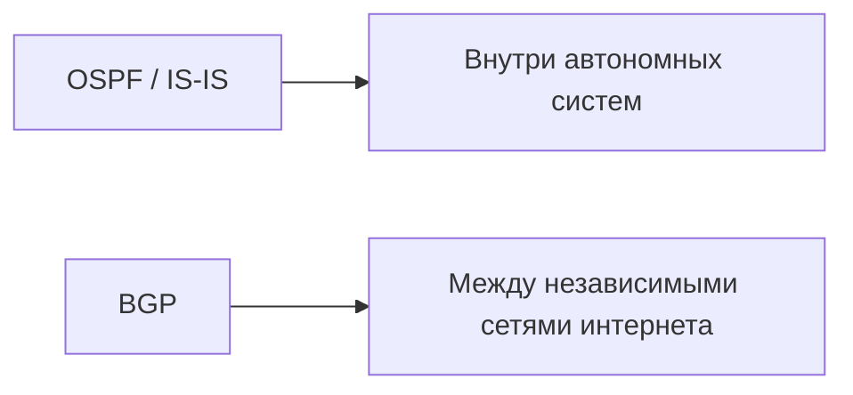
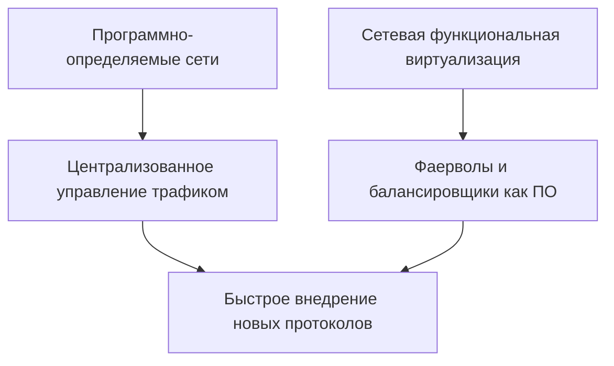

# Сетевые протоколы: архитектура цифрового взаимодействия

> 📋 *Стандартизированные правила обмена данными в компьютерных сетях*

---

## 🔹 Введение

**Сетевые протоколы** — это стандартизированные правила, определяющие:

| Аспект | Описание |
|--------|----------|
| **Синтаксис** | Структура пакета данных |
| **Семантика** | Значение полей и команд |
| **Синхронизация** | Временные зависимости при обмене |

> 💡 Без чётко прописанных соглашений устройства разных производителей, работающие под разными операционными системами, не смогли бы понимать друг друга.

---

## 🔹 Эталонные модели и принцип инкапсуляции

### Модель OSI (7 уровней)
```
7. Прикладной (Application)
6. Представительский (Presentation)
5. Сеансовый (Session)
4. Транспортный (Transport)
3. Сетевой (Network)
2. Канальный (Data Link)
1. Физический (Physical)
```

### Модель TCP/IP (4 уровня) — реальная основа интернета
```
4. Приложение (Application)
3. Транспорт (Transport)
2. Интернет (Internet)
1. Сетевой интерфейс (Network Interface)
```

### 🔄 Принцип инкапсуляции

```
[Данные приложения]
       ↓
+ [TCP-заголовок: порты, последовательность]
       ↓
+ [IP-заголовок: адреса отправителя/получателя]
       ↓
+ [Ethernet/Wi-Fi заголовок: MAC-адреса]
       ↓
[Физическая передача по среде]
```

> ✅ На приёмной стороне процесс повторяется в обратном порядке: каждый уровень «снимает» свой заголовок и передаёт полезную нагрузку выше.

---

## 🔹 Протоколы ключевых уровней

### 📡 Канальный уровень
| Протокол | Назначение |
|----------|-----------|
| **Ethernet** | Проводные локальные сети |
| **IEEE 802.11 (Wi-Fi)** | Беспроводные сети |

> Решают задачи: обнаружение коллизий, управление доступом к среде, коррекция ошибок.

### 🌐 Сетевой уровень

#### IPv4 vs IPv6
| Параметр | IPv4 | IPv6 |
|----------|------|------|
| Год создания | 1981 | 1998 |
| Длина адреса | 32 бита | 128 бит |
| Количество адресов | ~4.3 млрд | 3.4×10³⁸ |
| Статус | Истощён | Активно внедряется |

> 📊 **На 2026 год**: более **45%** трафика глобального интернета передаётся через IPv6 (особенно в Азии и Северной Америке).

#### Протоколы маршрутизации


### ⚙️ Транспортный уровень

#### TCP (Transmission Control Protocol)
```
✅ Надёжная доставка
✅ Трёхэтапное рукопожатие: SYN → SYN-ACK → ACK
✅ Подтверждения (ACK) и повторные передачи
✅ Алгоритмы управления перегрузкой (Cubic)
❌ Бо́льшие задержки
```

#### UDP (User Datagram Protocol)
```
✅ Минимальные задержки
✅ Без установки соединения
✅ Без подтверждений
❌ Нет гарантий доставки
```

> 🎯 **Применение UDP**: VoIP, онлайн-игры, стриминг — где потеря пакета менее критична, чем задержка.

#### 🚀 Протокол QUIC (HTTP/3)
| Преимущество | Описание |
|-------------|----------|
| **Основа** | Работает поверх UDP |
| **Надёжность** | Реализуется на прикладном уровне |
| **Мультиплексирование** | Устраняет «блокировку очереди» TCP |
| **Мобильность** | Мгновенное восстановление при смене сети |

---

## 🔹 Прикладной уровень

### 📋 Основные протоколы

```markdown
🔹 DNS / DNS-over-HTTPS (DoH)
   └─ Преобразование доменных имён → IP-адреса
   └─ Шифрование запросов для защиты приватности

🔹 HTTP эволюция:
   • HTTP/0.9 — простой текстовый
   • HTTP/2 — мультиплексирование, сжатие заголовков
   • HTTP/3 — на базе QUIC, полная переработка

🔹 Электронная почта:
   • SMTP — отправка
   • POP3 / IMAP — получение
   • ✅ Обязательно: STARTTLS или порты 465/993

🔹 WebRTC
   └─ Прямое P2P-взаимодействие браузеров
   └─ Видеоконференции без промежуточных серверов
```

---

## 🔹 Безопасность: от уязвимостей к защищённым стандартам

### ⚠️ Исторические проблемы
```
❌ HTTP/FTP — передача данных и паролей в открытом виде
❌ DNS — уязвимость к кэш-отравлению
❌ Устаревшие шифры в ранних версиях TLS
```

### 🛡️ Современная парадигма: «Безопасность по умолчанию»

| Протокол | Ключевые улучшения |
|----------|-------------------|
| **TLS 1.3** (2018) | • Установка соединения за 1 RTT<br>• Удалены уязвимые шифры |
| **QUIC** | • Шифрование на транспортном уровне<br>• Защита от анализа трафика провайдером |

### 🔮 Будущее безопасности
> 🧬 **Постквантовая криптография** — уже тестируется в экспериментальных версиях протоколов для защиты от атак квантовых компьютеров.

---

## 🔹 Современные вызовы и перспективы

### 🔄 Миграция на IPv6
```
📌 Сложности:
   • Унаследованная инфраструктура
   • Необходимость двойного стека (IPv4/IPv6)
   • Обучение персонала
```

### 🌍 Интернет вещей (IoT)
| Протокол | Особенности | Применение |
|----------|-------------|-----------|
| **MQTT** | Очереди сообщений, минимальный оверхед | Телеметрия, датчики |
| **CoAP** | Аналог HTTP для ограниченных устройств | Умный дом, носимые устройства |

### 🧠 SDN и NFV — новая парадигма


---

## 🔹 Заключение

> 🌐 **Сетевые протоколы** — это не просто технические спецификации, а **основа цифровой цивилизации**.

### Ключевые выводы:
```
✅ Эволюция: от ARPANET до самоадаптирующихся защищённых систем
✅ Понимание протоколов важно не только инженерам, но и разработчикам
✅ Выбор (TCP/UDP, HTTP/2/3, IPv4/IPv6) напрямую влияет на:
   • Производительность
   • Отказоустойчивость  
   • Безопасность сервиса
```

### 🎯 Будущее принадлежит протоколам, которые обеспечат:
| Требование | Область применения |
|-----------|-------------------|
| ⚡ Низкие задержки | Метавселенные, автономные системы |
| 🔋 Энергоэффективность | Миллиарды IoT-устройств |
| 🔐 Встроенная защита | Эпоха киберугроз |

> 💡 *Инвестиции в исследования протокольных стеков сегодня определят архитектуру глобальных сетей завтра.*

---

```markdown
📄 Документ подготовлен на основе материала:
"Сетевые протоколы: архитектура цифрового взаимодействия"
🗓️ Актуально на: 2026 год
```

---

