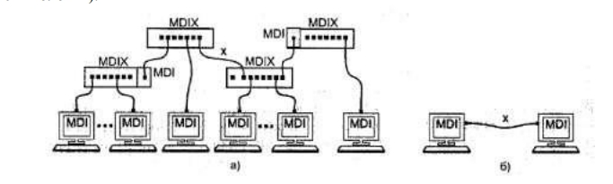

# 🖥️ Лабораторная работа №1
## Подключение персонального компьютера к локальной вычислительной сети

<div align="center">


</div>

---

## 📋 Информация о студенте

| Параметр | Значение |
| :--- | :--- |
| **ФИО** | `[Козлов Аптем]` |
| **Группа** | `[Ипо8482]` |

---

---

## 🛠️ Используемое оборудование и материалы

| Компонент | Характеристики / Модель | Примечание |
| :--- | :--- | :--- |
| **Персональный компьютер** | `[Модель ПК]` | IBM PC-совместимый |
| **Сетевая карта (NIC)** | `[Модель]` | Шина: `[PCI / PCIe / Встроенная]` |
| **Кабель** | `UTP Cat [5 / 5e / 6]` | Количество жил: `[4 / 8]` |
| **Разъемы** | `RJ-45 (8P8C)` | Количество шт.: `[__]` |
| **Инструмент** | `[Модель обжимных щипцов]` | Или отвертка (если вручную) |
| **Тестер** | `[Модель тестера / Омметр]` | Для проверки целостности |

---

## 📚 Теоретические материалы

### Кабель UTP и разъемы RJ-45


*Рис. 1.1 - Кабель UTP категории 5 (слева) и разъем RJ-45 (вилка и розетка)*

### Топология сети Ethernet


*Рис. 1.2 - Сеть 10BaseT/100BaseTX: а) звезда, б) непосредственное соединение двух компьютеров*

### Схемы обжима кабеля


*Рис. 1.3 - Интерфейсные кабели Ethernet: а) прямой, б) перекрестный (кроссовый)*


*Рис. 1.4 - Гальваническая развязка сетевых адаптеров*

---

## 🔧 Инструменты и оборудование


*Рис. 1.5 - Обжимной инструмент для разделки UTP-кабеля (а) и последовательность снятия внешней оболочки (б)*

### Схемы заделки проводов


*Рис. 1.6 - Варианты заделки проводов (схемы T568A и T568B)*


*Рис. 1.7 - Порядок обжима вилки RJ-45*


*Рис. 1.8 - Варианты монтажа 4-жильного кабеля*

---

## 📝 Задание к работе

Выберите тип выполненного задания (отметьте `[x]`):

- [ ] **Задание А:** Смонтировать UTP-кабель для соединения ПК с сетевым устройством (концентратором/коммутатором) → **Прямой кабель (Straight)**
- [ ] **Задание Б:** Смонтировать UTP-кабель для непосредственного соединения двух ПК → **Перекрестный кабель (Cross-over)**

### Параметры монтируемого кабеля

| Параметр | Значение |
| :--- | :--- |
| **Тип обжима** | `[Прямой / Перекрестный]` |
| **Схема заделки (T568)** | `[A / B]` (Рекомендуется B) |
| **Длина кабеля** | `[______] см` |
| **Скорость передачи** | `[10 / 100 / 1000] Мбит/с` |

---

## 🔌 Распиновка разъема RJ-45

> **Важно:** Заполните фактический порядок цветов жил, который вы использовали при обжиме.

### 🟢 Конец №1 (Со стороны ПК)

| Пин | Цвет жилы | Пин | Цвет жилы |
| :---: | :--- | :---: | :--- |
| **1** | `[__________]` | **5** | `[__________]` |
| **2** | `[__________]` | **6** | `[__________]` |
| **3** | `[__________]` | **7** | `[__________]` |
| **4** | `[__________]` | **8** | `[__________]` |

### 🟠 Конец №2 (Со стороны устройства/ПК)

| Пин | Цвет жилы | Пин | Цвет жилы |
| :---: | :--- | :---: | :--- |
| **1** | `[__________]` | **5** | `[__________]` |
| **2** | `[__________]` | **6** | `[__________]` |
| **3** | `[__________]` | **7** | `[__________]` |
| **4** | `[__________]` | **8** | `[__________]` |

---

## 💻 Сетевой адаптер


*Рис. 1.9 - Сетевая карта шины данных PCI: 1- разъем RJ-45, 2- светодиодный индикатор, 3- шина PCI, 4- панелька BootROM, 5- микросхема контроллера, 6- коннектор Remote Wake Up*

### Характеристики сетевого адаптера

> 💡 *Для получения данных используйте команду `ipconfig /all` в командной строке.*

| Параметр | Значение |
| :--- | :--- |
| **Модель адаптера** | `[Название из диспетчера устройств]` |
| **MAC-адрес (Физический)** | `[XX-XX-XX-XX-XX-XX]` |
| **Производитель (по MAC)** | `[Например: Realtek / Intel / Cisco]` |
| **Адрес ввода-вывода (I/O)** | `[0x______]` (если доступно) |
| **Номер прерывания (IRQ)** | `[______]` (если доступно) |
| **Поддерживаемые скорости** | `[10/100/1000 Мбит/с]` |

---

## 🌐 Проверка подключения и связи

### 1. Конфигурация IP (ipconfig)

```
C:\Users\User> ipconfig /all

# Вставьте вывод команды ниже:
[_________________________________________________________________]
[_________________________________________________________________]
[_________________________________________________________________]
```

### 2. Проверка связи (ping)

> Проверьте связь с шлюзом или другим узлом сети.

```
C:\Users\User> ping [IP-адрес узла]
 
# Вставьте вывод команды ниже:
[_________________________________________________________________]
[_________________________________________________________________]
```

**Статистика соединения:**
- **Отправлено:** `[4]`
- **Получено:** `[__]`
- **Потеряно:** `[__]` (`[__]%`)
- **Мин. время:** `[__] мс`
- **Макс. время:** `[__] мс`
- **Ср. время:** `[__] мс`

### 3. Результаты тестирования кабеля

| Индикатор тестера | Статус | Примечание |
| :---: | :---: | :--- |
| 1 | `[✅ / ❌]` | `[Если есть замыкание/обрыв]` |
| 2 | `[✅ / ❌]` | |
| 3 | `[✅ / ❌]` | |
| 4 | `[✅ / ❌]` | |
| 5 | `[✅ / ❌]` | |
| 6 | `[✅ / ❌]` | |
| 7 | `[✅ / ❌]` | |
| 8 | `[✅ / ❌]` | |

---


## ❓ Контрольные вопросы

## 1. Кабели Ethernet и UTP

**Типы кабелей Ethernet:**
- **UTP** (Unshielded Twisted Pair) — неэкранированная витая пара
- **FTP/STP** — экранированная витая пара
- **Оптоволокно** (Single-mode / Multi-mode)
- **Коаксиальный** (устаревший, 10BASE2/5)

**UTP-кабель** — 4 пары скрученных медных жил без общего экрана.


---

## 2. Устройства MDI / MDI-X и кроссовер-кабель

| Тип | Описание | Примеры устройств |
|-----|----------|------------------|
| **MDI** | Передаёт на контактах 1,2; принимает на 3,6 | ПК, серверы, роутеры |
| **MDI-X** | Передаёт на 3,6; принимает на 1,2 | Коммутаторы, хабы |

**Кроссовер (cross-over)** нужен при соединении **однотипных устройств**:
- ПК ↔ ПК
- Коммутатор ↔ Коммутатор


---

## 3. Почему не нужно снимать изоляцию с жил при обжимке RJ-45?

- В вилке RJ-45 установлены **ножевые контакты (IDC)**, которые при обжимке:
  1. Прорезают изоляцию жилы
  2. Обеспечивают надёжный электрический контакт с медным проводником
  3. Фиксируют жилу механически

**Преимущества такого решения:**
- ⚡ Быстрее и проще монтаж
- 🔒 Исключается риск повреждения тонкой жилы
- 🛡️ Изоляция остаётся в месте входа в коннектор — меньше риск обрыва


---

## 4. Нуль-модемный кабель

**Нуль-модемный кабель** — последовательный кабель (RS-232), в котором перекрещены линии передачи и приёма:
```
TX (2) ↔ RX (3)
RX (3) ↔ TX (2)
GND (5) ↔ GND (5)
```

**Применение:**
- Прямое соединение двух ПК через COM-порт
- Конфигурирование сетевого оборудования (консольный порт)
- Отладка встроенных систем (embedded)


---

## 5. Идентификация сетевых адаптеров и смена MAC-адреса

**Идентификация:** каждый сетевой адаптер имеет уникальный **48-битный MAC-адрес** (формат `XX:XX:XX:XX:XX:XX`), присваиваемый производителем (первые 3 байта — OUI-код вендора).

**Зачем нужна возможность смены MAC (MAC spoofing):**

| Цель | Пример |
|------|--------|
| 🔐 Конфиденциальность | Скрытие реального адреса в публичных сетях |
| 🔄 Замена оборудования | Обход привязки сервиса к старому MAC |
| 🧪 Тестирование | Эмуляция нескольких устройств в одной сети |
| 🛡️ Безопасность | Обход простых фильтров по MAC (не надёжно!) |


---

## 6. Конфигурирование сетевой платы

**Процесс настройки** включает установку программных и сетевых параметров:

### Основные параметры:
```bash
# Адресация
- IP-адрес (статический или через DHCP)
- Маска подсети
- Шлюз по умолчанию
- DNS-серверы

# Физические/канальные настройки
- Скорость и дуплекс (Auto/100M/1G, Full/Half)
- MTU (размер пакета)
- VLAN-теги (при необходимости)

# Дополнительные
- Имя интерфейса (eth0, enp3s0)
- Включение/выключение интерфейса
- Правила фаервола
```

### Примеры команд:
```bash
# Linux
ip addr add 192.168.1.10/24 dev eth0
ip link set eth0 up
dhclient eth0  # Получить адрес автоматически

# Windows (PowerShell)
New-NetIPAddress -IPAddress 192.168.1.10 -PrefixLength 24 -InterfaceAlias "Ethernet"
Set-DnsClientServerAddress -InterfaceAlias "Ethernet" -ServerAddresses 8.8.8.8
```

